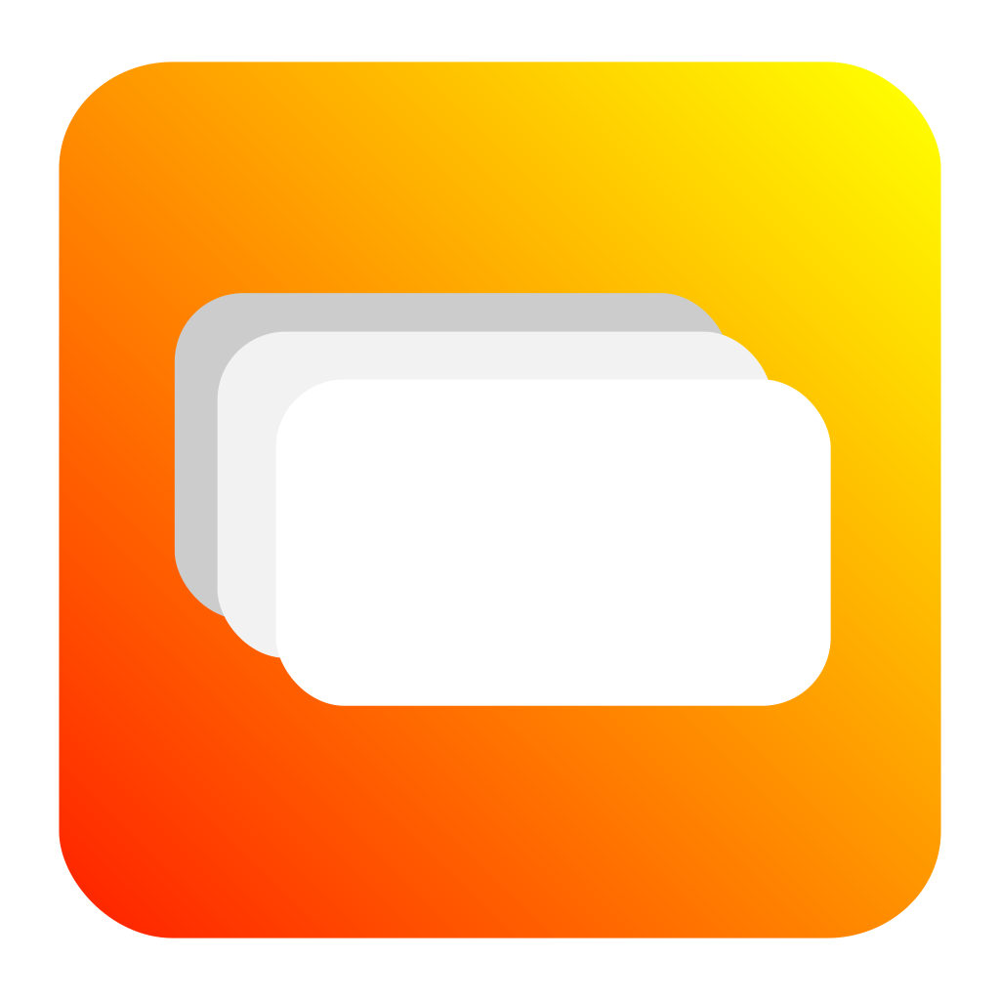

<div align="center" style="padding-top: 25px;">
        
        <h1>nvdialog-rs: Rust bindings to NvDialog</h1>
        
        
        
</div>

This crate offers Rust bindings to [NvDialog](https://github.com/AndroGR/nvdialog) and abstracts away the pointers and other nasty stuff in favor of Rust principles. This crate **will NOT build NvDialog manually**. You should have a build of NvDialog available in your system at runtime or package it with your application.

# Features
- High-level Rust bindings with increased safety around the C parts.
- Native-dialogs using the OS's API.
- File dialogs, Notifications, Dialog Boxes, and other dialogs supported by NvDialog.
- Low-overhead.
- Extremely easy to use.
- Only one dependency!

# NOTE:
The [`nvdialog`](https://crates.io/crates/nvdialog) crate (Which I also created) has been deprecated and replaced by this crate, which is much more minimal and easy to use. If you have been using the former, immediately switch to this one.

# Example
```rust
extern crate nvdialog_rs;
use nvdialog_rs::DialogBox;
use nvdialog_rs::DialogType;

fn main() {
        /* Initialize the library. This corresponds to `nvd_init` */
        nvdialog_rs::init();

        /* Creating the dialog box. */
        let dialog_box = DialogBox::new(
                "Hello from Rust!", /* Title of the dialog */
                /* Message of the dialog */
                "This dialog has been created using Rust and NvDialog bindings to the language.",
                /* See documentation for more */
                DialogType::Simple
        );

        /* Showing the dialog box. */
        dialog_box.show();
}
```

# License
This library is licensed under the MIT License:
```
The MIT License (MIT)
Copyright © 2022 Aggelos Tselios and contributors on NvDialog.

Permission is hereby granted, free of charge, to any person obtaining a copy of this software and associated documentation files (the “Software”), to deal in the Software without restriction, including without limitation the rights to use, copy, modify, merge, publish, distribute, sublicense, and/or sell copies of the Software, and to permit persons to whom the Software is furnished to do so, subject to the following conditions:

The above copyright notice and this permission notice shall be included in all copies or substantial portions of the Software.

THE SOFTWARE IS PROVIDED “AS IS”, WITHOUT WARRANTY OF ANY KIND, EXPRESS OR IMPLIED, INCLUDING BUT NOT LIMITED TO THE WARRANTIES OF MERCHANTABILITY, FITNESS FOR A PARTICULAR PURPOSE AND NONINFRINGEMENT. IN NO EVENT SHALL THE AUTHORS OR COPYRIGHT HOLDERS BE LIABLE FOR ANY CLAIM, DAMAGES OR OTHER LIABILITY, WHETHER IN AN ACTION OF CONTRACT, TORT OR OTHERWISE, ARISING FROM, OUT OF OR IN CONNECTION WITH THE SOFTWARE OR THE USE OR OTHER DEALINGS IN THE SOFTWARE.
```